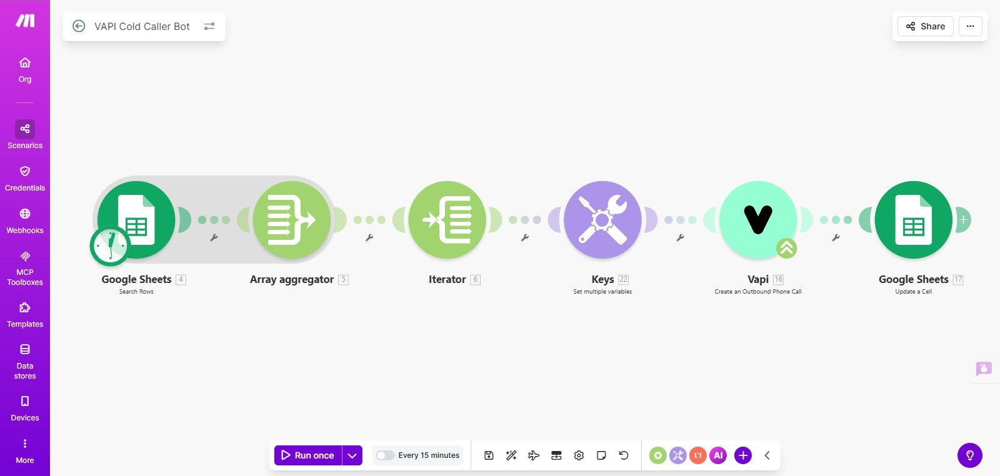

# 🤖 AI Voice Agent for Customer Support

An AI-powered voice agent capable of handling real-time customer calls, understanding natural language queries, and triggering backend automation workflows.

This project demonstrates how modern companies can automate inbound customer support using **AI Voice Agents**, **automation workflows**, and **telephony integration**.

The system combines conversational AI with workflow automation to reduce manual effort in customer support operations.

---

# 🚀 Project Overview

Customer support teams spend significant time handling repetitive calls.

This AI Voice Agent solves that problem by:

• Answering incoming customer calls  
• Understanding the caller's request  
• Extracting important information  
• Triggering automated workflows  
• Creating or updating support tickets  
• Sending notifications to teams  

The goal of this project is to demonstrate how **AI-powered voice automation** can transform support operations.

---

# 🏗 System Architecture

The system seamlessly integrates multiple components to deliver a fully automated customer support workflow. Upon receiving a call, the AI agent analyzes the conversation in real time and automatically triggers the appropriate downstream workflow, ensuring efficient and accurate handling of every customer interaction.

---

# 🧠 Technologies Used

AI Voice Platform  
• Vapi AI

Automation Platform  
• Make.com

Connectivity  
• SIP Telephony

Other Components  
• Prompt Engineering  
• Workflow Automation  
• API Integrations

---

# ⚙️ Core Components

## 1. AI Voice Agent

The voice agent is trained to interact with customers naturally.

Capabilities include:

• Understanding customer queries  
• Responding conversationally  
• Collecting structured information  
• Triggering backend automation workflows  

The AI agent acts as the **first line of support** for incoming calls.

---

## 2. Automation Workflow

Below is the automation workflow used in this project.

The workflow connects the voice agent with backend systems and processes customer requests automatically.

Typical automated actions include:

• Logging customer requests  
• Creating support tickets  
• Updating databases  
• Sending alerts to support teams  

Automation ensures that the conversation results in meaningful actions.

---

## 3. SIP Telephony Integration

SIP connectivity enables real-time phone calls to interact with the AI voice agent.

This allows the system to function like a real support call center assistant.

---

# 🔄 Workflow Process

1. Customer calls the support number  
2. Call connects via SIP telephony  
3. AI voice agent answers the call  
4. AI understands the customer’s request  
5. Automation workflow is triggered  
6. Support system is updated automatically  

This process eliminates manual call handling for routine requests.

---

---

# 💼 Business Use Cases

This system can be implemented in various industries:

Customer Support Centers  
Healthcare Appointment Scheduling  
Banking and Financial Services  
E-commerce Order Support  
IT Helpdesk Automation  

Organizations can deploy AI voice agents to handle repetitive tasks while human teams focus on complex cases.

---

# 📈 Benefits of AI Voice Automation

• Reduced support workload  
• Faster response times  
• 24/7 customer assistance  
• Improved operational efficiency  
• Scalable support operations  

AI voice agents allow companies to deliver consistent support without increasing operational costs.

---

# 🔮 Future Improvements

• CRM integrations (HubSpot, Salesforce)  
• Multi-language support  
• Advanced conversation analytics  
• Cloud deployment for scalability  
• Integration with ticketing systems  

---

# 👩‍💻 Author

Sirisha D

AI & Automation Builder

Passionate about building AI-powered systems that automate real-world business workflows.

